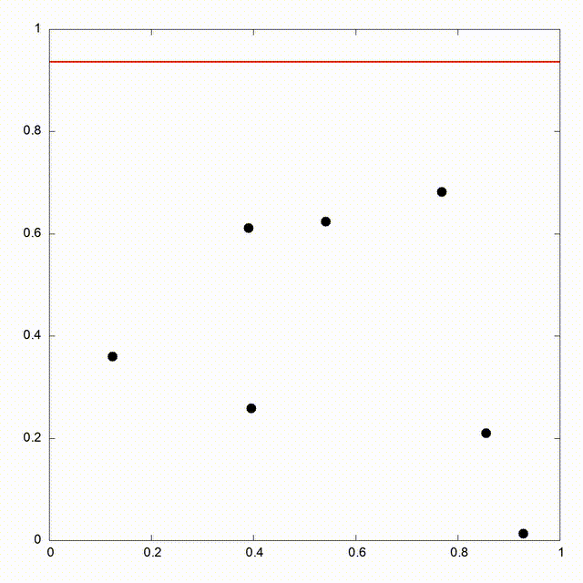
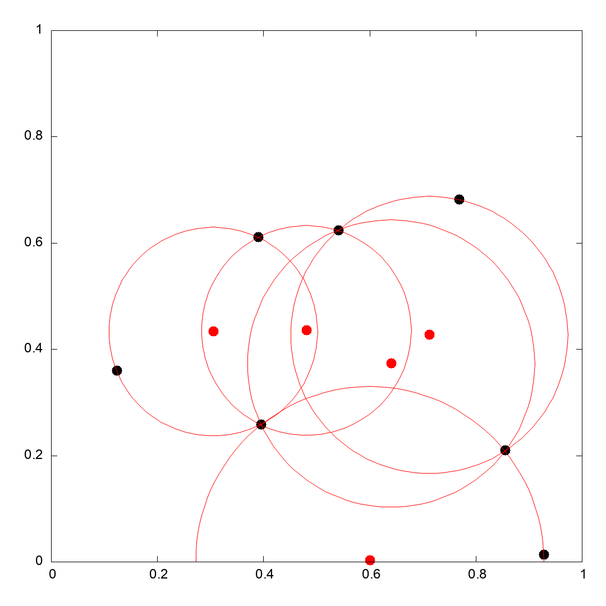

# voronoi_fortune

This is an incomplete, simple and naive implementation of ***Fortune's algorithm***. 
It's main purpose is to visualize the inner workings of the algorithms by the sweep of a *beachline*.

As such, the code generates some random seeds and produces a video output (using *gnuplot* and *ffmpeg*) of the beachline traversing the seeds. As it stands, no voronoi diagram is being generated, and the code is not efficient.

## Known problems
- Specially for higher seeds, some vertex events are either not created or the wrong arc disappears, resulting in a beachline that is incorrect (overlapping arcs etc...).
- I suspect some numerical instabilities when computing inscribed circles and intersection of parabolas, thus why I introduced the EPS constant (precission erros) to compare doubles.

## Potential upgrades
- Right now, the beachline is a doubly linked list. However, to improve the efficiency of the search and traversing operations, this might be implemented as a tree.
- Produce a Voronoi diagram using DCEL (*Doubly Connected Edge List*).

# EXAMPLE OF CURRENT OUTPUT

  

  

